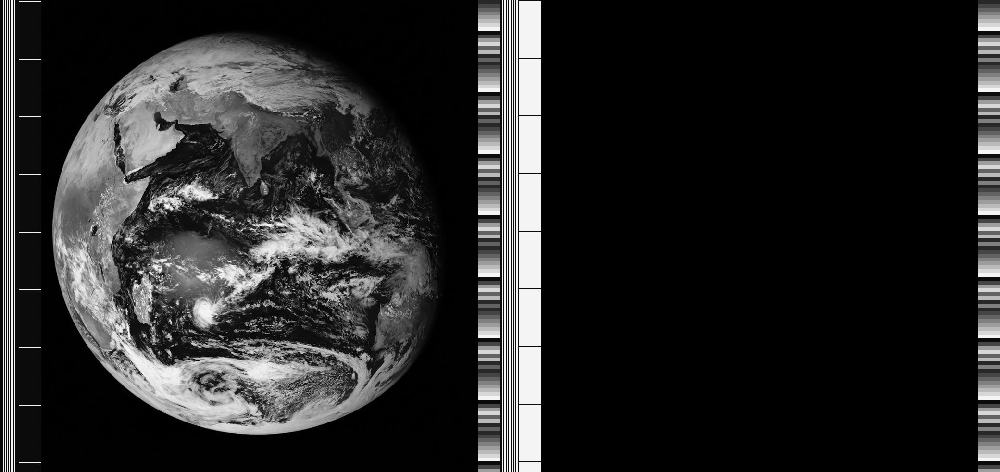

# NOAA APT Signal Generator

A generator for synthetic **NOAA Automatic Picture Transmission (APT)** signals.

This project produces standards-aligned APT video frames and modulates them onto
a 2400 Hz AM subcarrier, enabling controlled testing of decoding pipelines, DSP
chains, and SDR software such as **SatDump**.

The implementation follows the APT line structure described in the [NOAA KLM
User’s Guide]((https://web.archive.org/web/20070316190349/http://www2.ncdc.noaa.gov/docs/klm/html/c4/sec4-2.htm#f423-3)
).

## Requirements

Python 3.9+

```bash
pip install numpy pillow
```

## Usage

### Generate an APT Raster

Single image (Channel B is black):

```bash
python apt_builder.py input.jpg apt.png
```


Dual-channel transmission:

```bash
python apt_builder.py image_a.jpg apt.png --input-png-b image_b.jpg
```


If the source images differ in height, the shorter image is padded with black
lines to preserve line alignment.

---

### Generate the Audio Signal

```bash
python apt_modulator.py apt_1.jpg out.wav
```

Default modulation parameters:

| Parameter   | Value      |
| ----------- | ---------- |
| Sample rate | 48 kHz     |
| Carrier     | 2400 Hz    |
| Modulation  | AM         |
| Bit depth   | 16-bit PCM |
| Channels    | Mono       |

The resulting file can be opened directly in decoders such as  **SatDump**.
